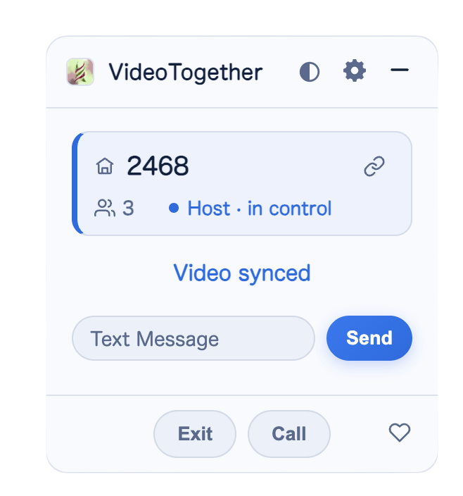

<h1 align="center">VideoTogether</h1>

<i>Watch together, anywhere.</i>　·　Free & open-source watch parties for any website

Watch any video, on any site, with friends — perfectly in sync, like you're all in the same room. 
Real-time playback sync, voice & text chat, and one-click room sharing.

<a href="./README_zh.MD">简体中文</a>　·　<a href="https://2gether.video/en-us/">Website</a>

## Features

- **Cross-site real-time sync** — Watch together on YouTube, Bilibili, Netflix, and most video & anime sites. The host plays, pauses, or seeks, and everyone follows automatically.
- **One-click room sharing** — Share an invite link and friends just click to join. No sign-up, no room codes to type.
- **Rooms & roles** — The host controls, viewers follow. Password-protected rooms supported.
- **Voice chat** — Talk while you watch; one click to call or hang up.
- **Text chat** — Don't want to hop on the mic? Type to chat without leaving the video.
- **Live stream support** — Live streams sync play/pause only (no forced seeking), so even channel-hopping stays together.
- **Dark glass theme** — Light/dark toggle, plus a mini floating window in fullscreen.
- **Multilingual** — 繁體中文 / 简体中文 / English / 日本語.
- **Multi-browser** — Chrome, Edge, Safari, Firefox, and userscript (Tampermonkey).

## Preview

A lightweight floating panel — room number, members, role, and sync status at a glance.

## Installation

### From a store

- [Chrome Web Store](https://chromewebstore.google.com/detail/videotogether/dpjiaamadbcfheiamdaamhgpomlkohbn)
- [Edge Add-ons](https://microsoftedge.microsoft.com/addons/detail/videotogether/eilkilgemogpkebfmhkkapogkiijikli)
- [App Store (Safari / iOS)](https://apps.apple.com/app/videotogether/id6443755429)

### Manual install from GitHub

Want the newest interface first? Install straight from the files on GitHub — no build step needed:

1. **Download the files** — click `Code → Download ZIP` at the top of this page, then unzip it somewhere permanent (don't delete or move the folder afterwards).
2. **Open the extensions page** — type `chrome://extensions` in the address bar (or `edge://extensions` on Edge).
3. **Allow local extensions** — turn on the toggle in the top-right (labeled "Developer mode" in Chrome).
4. **Pick the folder** — click **Load unpacked** and choose the `source/chrome` subfolder inside the unzipped folder.
5. The VideoTogether icon appears in your toolbar — you're set.

> - **Firefox**: open `about:debugging` → **This Firefox** → **Load Temporary Add-on**, and pick `manifest.json` inside `source/firefox`.
> - This method doesn't auto-update — re-download the files when you want the latest, then hit **Reload** on the extensions page.

## Getting started

Once installed, three steps to watch together:

1. Open any video site and click the extension icon → create a room.
2. Copy the invite link and send it to your friends.
3. They click the link — auto-join, auto-sync. Press play!

## Community / Issues

The docs are still a work in progress — join the chat for help, report problems, and PRs are welcome:

- Telegram: <https://t.me/videotogether_group>
- QQ group: 170200260

## Development

See the [development docs](./docs/en/development.md).

- **Extension**: Core code lives in `source/extension/vt.js`, with a shell extension `source/extension/extension.js` (so users keep getting the latest version after install). `{{{ }}}` marks where a file is injected. Run `python script/build_extension.py` to build; the output goes to `release/`.
- **Server**: Code is in `source/go-server`.

## License

Open-sourced under the MIT License — see [LICENSE](./LICENSE).

## Sponsors

Angel-round sponsor

Qixi Festival sponsor

