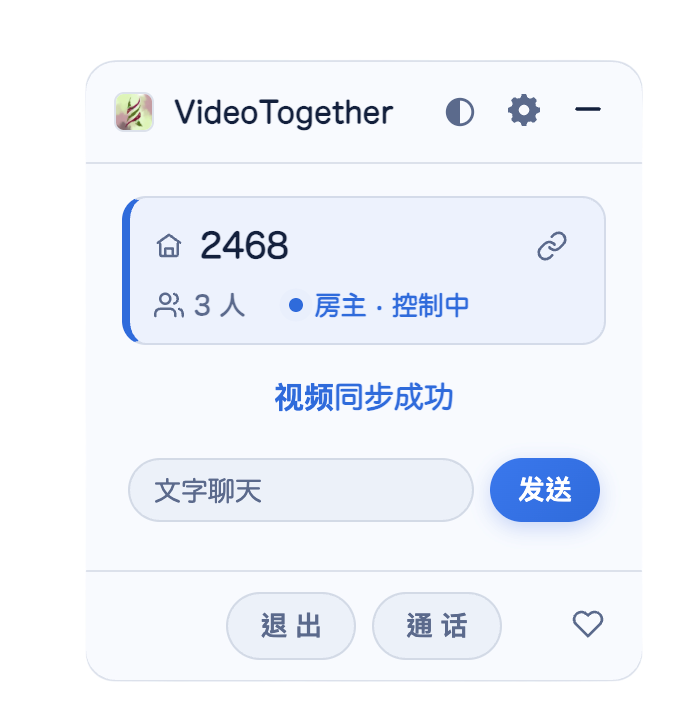

<h1 align="center">VideoTogether</h1>

<i>Watch together, anywhere.</i>　·　免费开源的多人同步观影工具

和朋友一起看任何网站的视频，就像坐在同一个房间。 
实时同步播放、语音聊天、一键分享房间。

<a href="./README.MD">English</a>　·　<a href="https://2gether.video/">官方网站</a>

## 特色

- **跨网站实时同步** — YouTube、Bilibili、Netflix、各大影音／动漫网站都能一起看，房主播放／暂停／跳转，大家自动跟上。
- **一键分享房间** — 生成邀请链接，朋友点开就能进房，无需注册、不用手动输入房号。
- **房间＋角色** — 房主控制、观众跟随，可开密码房。
- **语音通话** — 边看边聊，一键通话／挂断。
- **文字聊天** — 不方便开麦，也能边看边打字聊天。
- **直播支持** — 只同步播放／暂停，不强行同步进度，换台也跟得上。
- **深色玻璃主题** — 浅色／深色切换，全屏还有迷你小窗。
- **多语言** — 繁體中文／简体中文／English／日本語。
- **支持多浏览器** — Chrome、Edge、Safari、Firefox 和用户脚本（Tampermonkey）。

## 界面预览

轻巧的浮动面板 — 房号、人数、角色与同步状态一目了然

## 安装

### 从商店安装

- [Chrome 网上应用店](https://chromewebstore.google.com/detail/videotogether/dpjiaamadbcfheiamdaamhgpomlkohbn)
- [Edge 加载项](https://microsoftedge.microsoft.com/addons/detail/videotogether/eilkilgemogpkebfmhkkapogkiijikli)
- [App Store（Safari / iOS）](https://apps.apple.com/app/videotogether/id6443755429)

### 从 GitHub 手动安装

想第一时间体验新界面，可以直接用 GitHub 上的文件安装，无需自己编译：

1. **下载文件** — 点本页右上角的 `Code → Download ZIP`，下载后解压到一个固定位置（之后别删除或移动这个文件夹）。
2. **打开扩展页** — 在地址栏输入 `chrome://extensions` 回车（Edge 则输入 `edge://extensions`）。
3. **允许加载本地扩展** — 打开页面右上角那个开关（Chrome 里标示为「开发者模式」）。
4. **选择文件夹** — 点「加载已解压的扩展程序」，选解压后文件夹里的 `source/chrome` 子文件夹。
5. 工具栏出现 VideoTogether 图标，就装好了。

> - **Firefox**：打开 `about:debugging` → 「此 Firefox」→「临时载入附加组件」，选择 `source/firefox` 里的 `manifest.json`。
> - 这种方式不会自动更新；要更新时重新下载文件，再到扩展页点一下「重新加载」即可。

## 开始使用

装好后，三步就能一起看：

1. 打开任意视频网站，点扩展图标 → 创建房间。
2. 复制邀请链接，发给朋友。
3. 朋友点开链接，自动进房、自动同步 —— 开看！

## 交流 / 反馈问题

文档持续完善中，欢迎加入交流群获取帮助、反馈问题，也欢迎提交 issue 和 PR：

- Telegram：<https://t.me/videotogether_group>
- QQ 群：170200260

## 开发

请查阅[开发文档](./docs/zh-cn/development.md)。

- **插件**：核心代码在 `source/extension/vt.js`，另有壳插件 `source/extension/extension.js`（让用户安装后能持续获取最新版）。代码中 `{{{ }}}` 表示把某个文件插入该处。运行 `python script/build_extension.py` 编译，结果在 `release` 目录。
- **服务端**：代码在 `source/go-server`。

## 开源协议

本项目以 MIT 许可证开源，详见 [LICENSE](./LICENSE)。

## 赞助

项目天使轮赞助

七夕追加赞助

